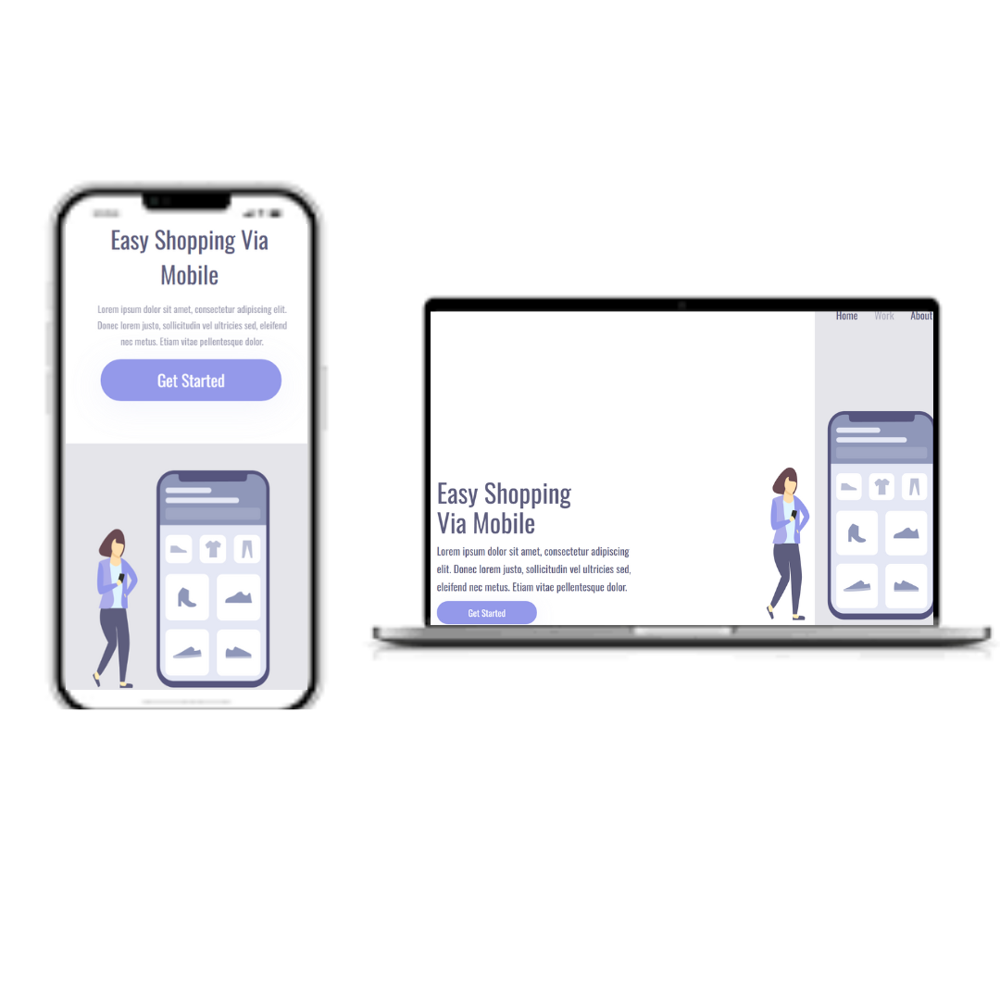
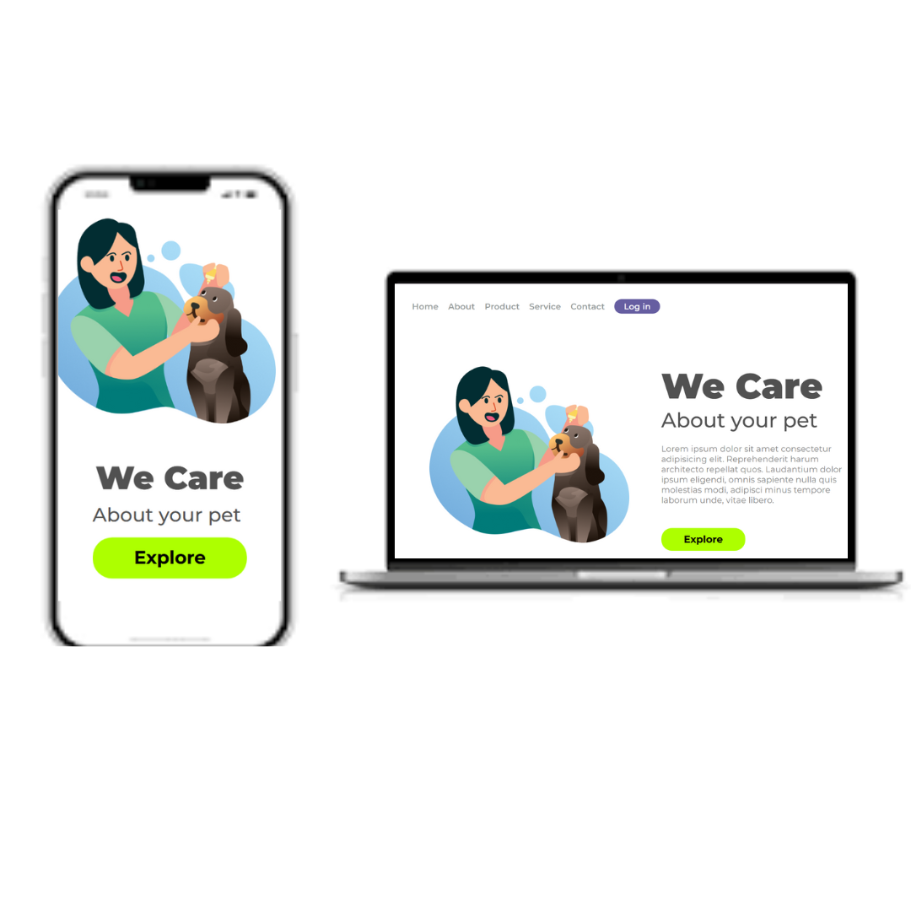
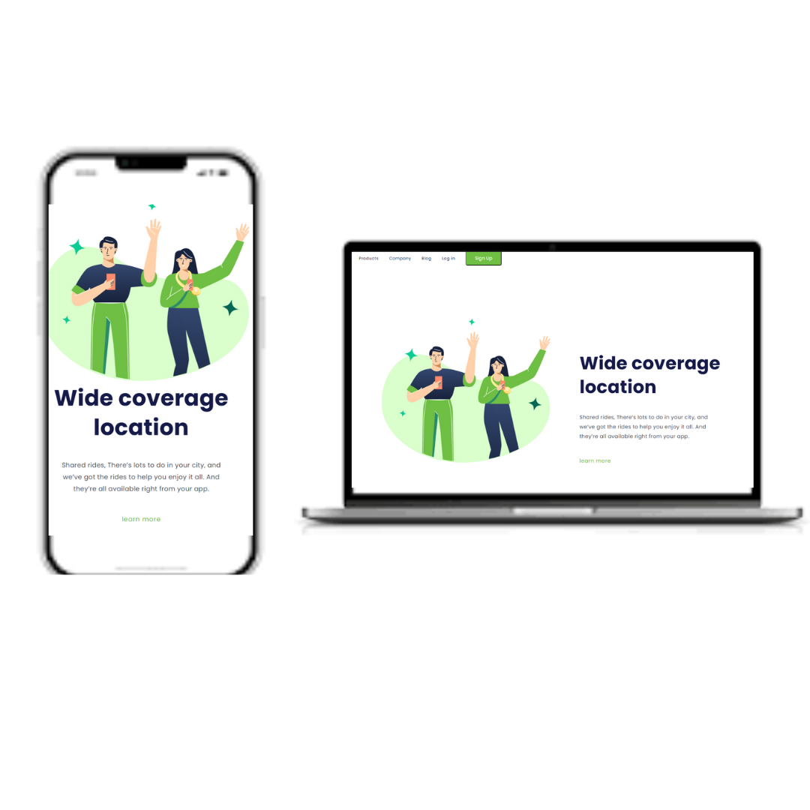

<h1> Projetos de Landing Page</h1>

Este repositório contém três projetos de landing page desenvolvidos com HTML e CSS, cada um com estilos e propósitos diferentes.

<h2>Estrutura</h2>

<h3>- **Free Shopping**</h3>
 
 - Arquivos: Free shopping  
  - Descrição: Landing page para um aplicativo de compras via mobile. Possui layout responsivo, botões de ação e navegação no topo.

  

<h3>- **We Care**</h3>

 - Arquivos: pasta: We care 
  - Descrição: Página voltada para cuidados com pets, com design moderno, fontes customizadas e destaque para o botão de exploração.

<h3>- **Wide Coverage**</h3>
 
 - Arquivos: pasta : Wide Coverage
  - Descrição: Landing page para serviço de transporte compartilhado, com foco em cobertura ampla de localização e chamada para ação.

<h3> Tecnologias</h3>

- HTML5
- CSS3
- Google Fonts

<h3> Responsividade</h3>

Todos os projetos possuem media queries para adaptação em telas menores (até 900px de largura).

---
